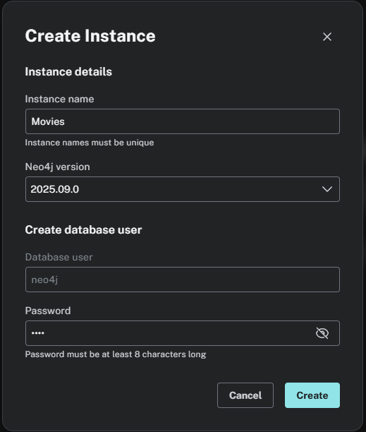
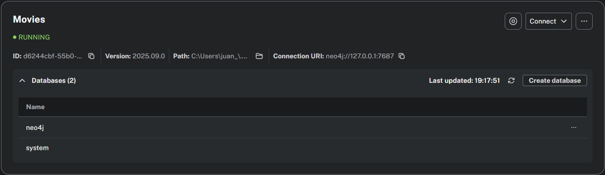
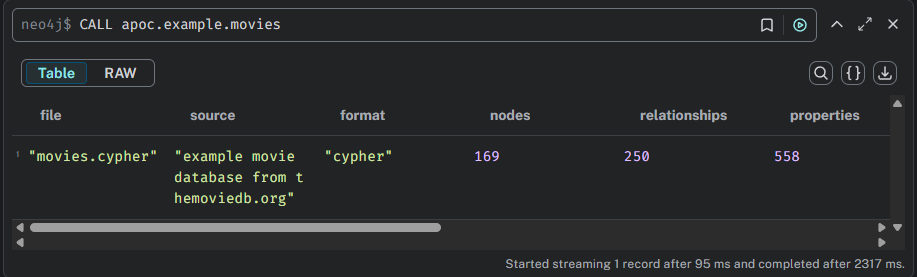
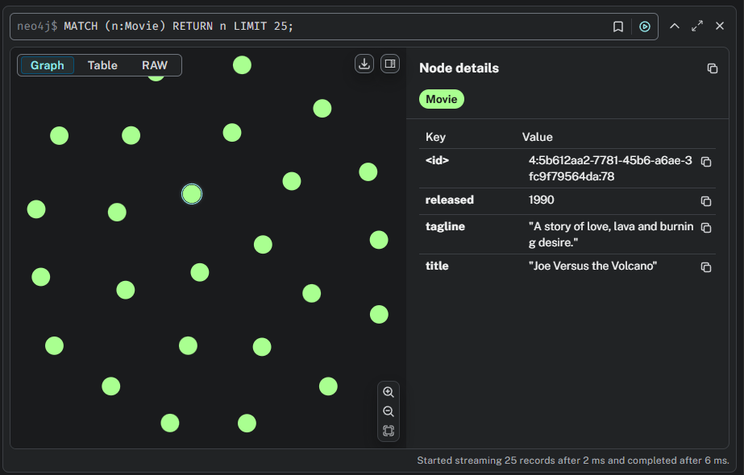
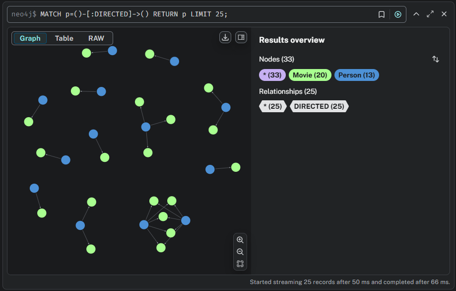
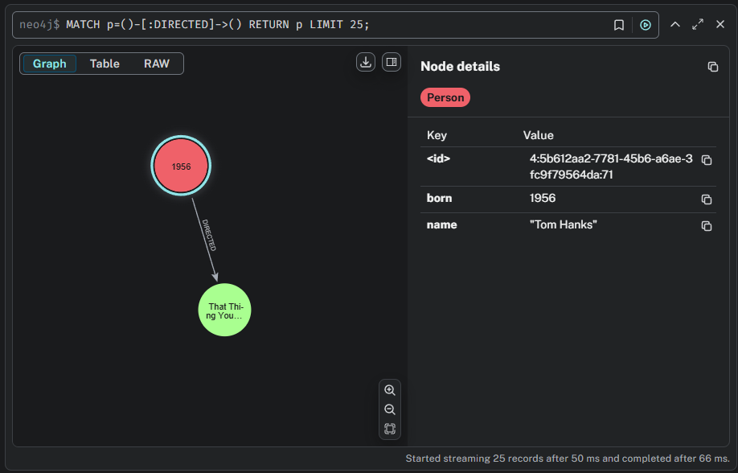
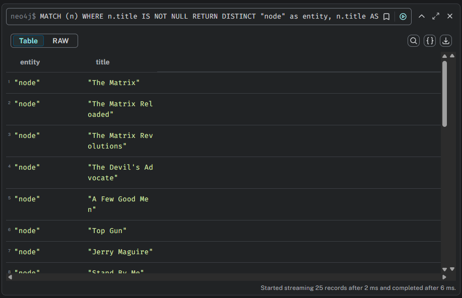
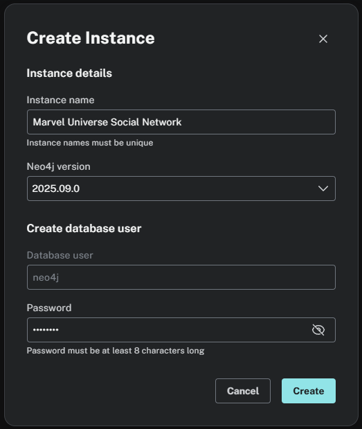
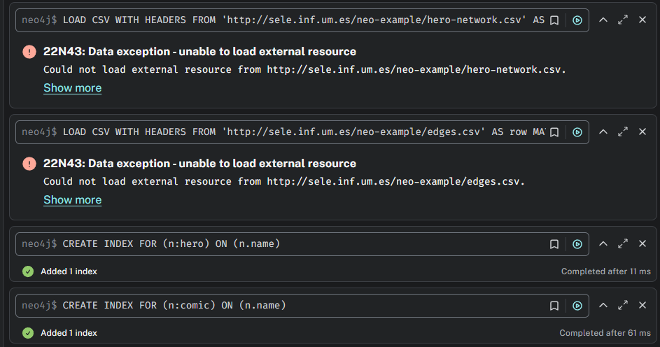
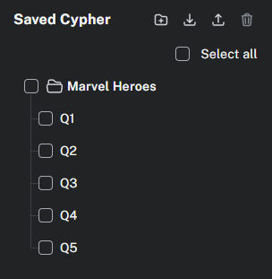

# Máster en Ingeniería del Software. Arquitectura de datos

Juan Hernández Acosta - juan.hernandeza@um.es

## Práctica 1. Introducción a Neo4J

### 1. Introducción

Durante el desarrollo de esta práctica nos familiarizaremos con las bases de datos de grafos, concretamente con Neo4J en el entorno Neo4J Desktop. Aprenderemos a crear grafos y realizar consultas en los mismos a través de Neo4J Query.

### 2. Creando la instancia Movies

El primer paso para la realización de la práctica será crear una instancia _Movies_ dentro de nuestro entorno de desarrollo.

Una vez creada, podemos ver que las instancias en Neo4J contienen dos bases de datos, neo4j y system.

### 3. Puesta en marcha del plugin APOC

Para continuar, instalaremos el plugin APOC que nos proporcionará funcionalidades adicionales así como la posibilidad de cargar la base de datos de ejemplo de películas. Una vez instalado el plugin, realizaremos la siguiente consulta para cargar el grafo de ejemplo.

### 4. Consultas 

Una vez cargado el grafo, tendremos acceso a todos sus nodos y aristas. Esta base de datos contiene los nodos películas y actores así como sus relaciones.

Haciendo uso de la interfaz gráfica, clicaremos en la etiqueta _Movie_ de la barra lateral para listar todos los nodos de este tipo. Por motivos de rendimiento, tan solo se muestran 25 nodos del total.

Podemos explorar la relación entre nodos del tipo _DIRECTED_ haciendo uso del menú anterior. Al hacer click, se nos mostrarán todos los nodos del tipo _Person_ relacionados con nodos _Movie_ a través de la arista _DIRECTED_ es decir, todos los directores junto las peliculas que dirigeron.

Si seleccionamos cualquiera de los nodos dentro del resultado de una consulta, podremos visualizar la información de todas sus propiedades, así como seleccionar la forma en la que se mostrarán todos los nodos del tipo seleccionado. En este caso, hemos cambiado el color por defecto de los nodos del tipo _Person_ a rojo.

Si seleccionamos en la barra lateral un elemento del tipo _propiedad_ como _title_, se hará la consulta donde se buscarán todos los valores de la propiedad _title_ en los nodos de la base de datos. Al no ser el resultado de esta consulta un grafo, se mostrará una tabla de datos en la respuesta.

### 5. Creación de una nueva instancia (Marvel Universe Social Network)

A lo largo de este ejercicio, cargaremos una base de datos externa y realizaremos consultas sobre ella.

El primer paso será crear la instancia _Marvel Universe Social Network_ para poder alojar los datos deseados.

Una vez creada la instancia, cargaremos el grafo con las siguientes consultas.

Como se puede observar, durante el desarrollo de esta memoria el recurso donde se encontraba el archivo .csv con el contenido de la base de datos no se encontraba disponbile.

Finalmente, Neo4J nos permite guardar las consultas realizadas en el lenguaje Cypher para sesiones futuras. En este caso hemos guardado las consultas anteriores.

### 6. Conclusión

Gracias a esta práctica hemos interiorizado los conceptos de las bases de datos basadas en grafos, las cuales demuestran su potencia cuando queremos persistir información donde el número de relaciones entre entidades no es fija desde el momento su creación.