# Máster en Ingeniería del Software. Arquitectura de datos

Juan Hernández Acosta - juan.hernandeza@um.es

## Práctica 2. Consultas en Neo4J. Cypher

### 1. Introducción

En esta práctica vamos a realizar una serie de consultas en Neo4J utilizando el lenguaje Cypher. Para ello, utilizaremos la base de datos de películas que viene por defecto con la instalación de Neo4J.

### 2. Consulta de entrenamiento 1

- Define una consulta que recupere la propiedad tagline de la película (Movie) titulada (title) “Top Gun”.

> MATCH (m:Movie)  
> WHERE m.title = 'Top Gun'  
> RETURN m.tagline  

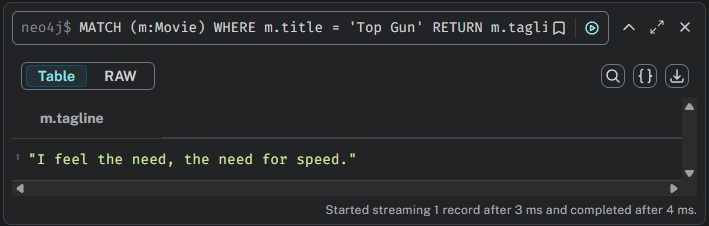

### 3. Consulta de entrenamiento 2

- Define una consulta que obtenga el nombre del productor o productores de la película When Harry Met Sally.

> MATCH (p:Person)-[:PRODUCED]->(m:Movie)  
> WHERE m.title = 'When Harry Met Sally'  
> RETURN p.name  

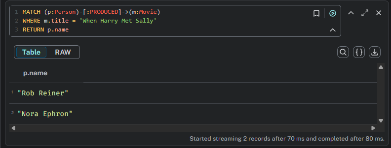

### 4. Consulta de entrenamiento 3

- Define una consulta que busque a la persona “Santiago Segura”, añada la película “El día de la bestia” y cree la relación entre el actor y la película.

> MATCH (p:Person {name: 'Santiago Segura'})  
> MERGE (m:Movie {title : 'El día de la bestia'})  
> MERGE (p)-[r:ACTED_IN]->(m)  
> RETURN p,r,m  

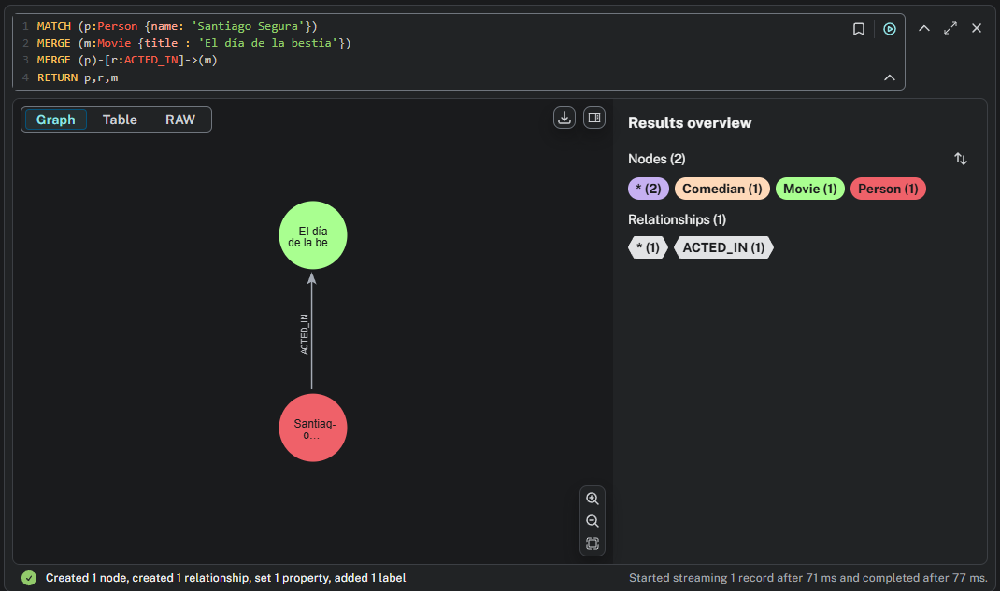

### 5. Consulta de entrenamiento 4

- Encontrar la película Padre no hay más que uno y añadirle las propiedades fecha de estreno (released)= 2019 y eslogan(tagline) = “¿Y cuándo decís que viene mamá?”

> MATCH (m:Movie {title: 'Padre no hay más que uno'})  
> SET m.tagline = '¿Y cuándo decís que viene mamá?'  
> SET m.released = 2019  
> RETURN m  

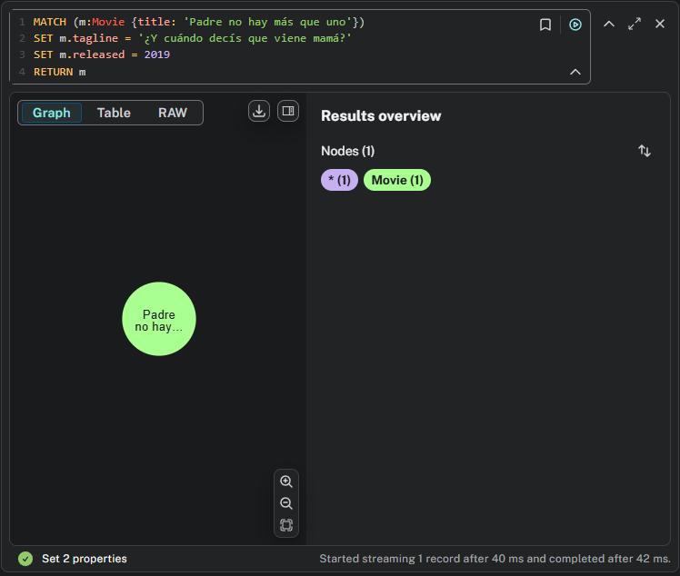

### 6. Consulta de entrenamiento 5

- Obtener el nombre de la persona, su papel y el título de la película en la que el papel incluya “agent”, haciendo la consulta case-insensitive.

> MATCH (p:Person)-[r:ACTED_IN]->(m:Movie)  
> WHERE any(role IN r.roles WHERE toLower(role) CONTAINS 'agent')  
> RETURN p.name, r.roles, m.title  

En este caso, hemos incluido la función predicativa _any_ ya que no podemos aplicar directamente el operador _CONTAINS_ a r.roles debido a que esta etiqueta es del tipo lista dentro de la relación.

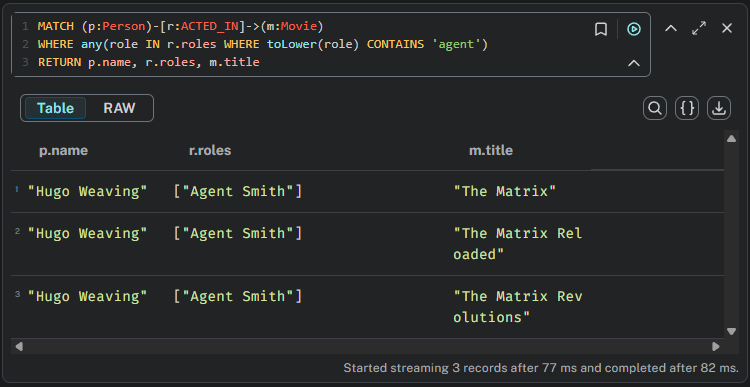

### 7. Consulta de entrenamiento 6

- Obtener el nombre de la persona que ha dirigido más películas, y el número de películas.

> MATCH (p:Person)-[r:DIRECTED]->(m:Movie)  
> RETURN p.name as director, count(m) as dirigidas  
> ORDER BY dirigidas DESC  
> LIMIT 1  

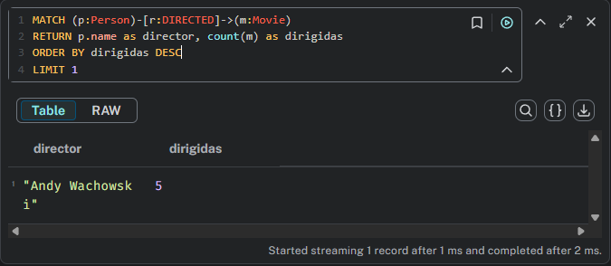

### 8. Consulta de entrenamiento 7

- Aunque no es la manera más natural de hacer esta consulta, utiliza la cláusula WITH y la función MAX para obtener el nombre del actor más joven.

- A continuación comprueba el resultado utilizando ORDER BY

> MATCH (p:Person)  
> WITH max(p.born) as menor  
> MATCH (p:Person)-[r:ACTED_IN]->(m:Movie)  
> WHERE p.born = menor  
> RETURN p  

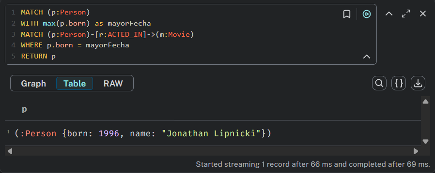

Observamos que tras realizar esta consulta el actor obtenido es _Jonathan Lipnicki_. Para comprobar que el resultado es el esperado, comparamos con la lista total de actores ordenada por edad con _ORDER BY_:

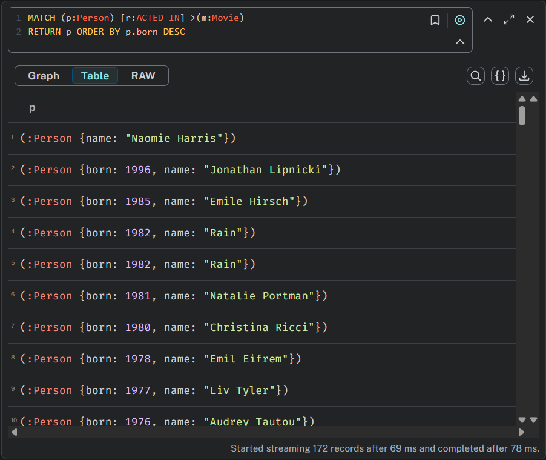

Como podemos ver, en este caso el primer resultado (sin tener en cuenta la primera persona devuelta puesto que esta no cuenta con el parámetro _born_)vuelve a ser _Jonathan Lipnicki_ por lo que confirmamos los resultados obtenidos en la búsqueda anterior.

### 9. Consulta de entrenamiento 8

- Obten el número total de películas dirigidas por Lana Wachowski y, a la vez, el título de las 3 películas más recientes que ha dirigido

> CALL(){  
> MATCH (p:Person)-[:DIRECTED]->(m:Movie)  
> WHERE p.name = 'Lana Wachowski'  
> RETURN m  
> }  
> RETURN m.title, m.released ORDER BY m.released DESC LIMIT 3  

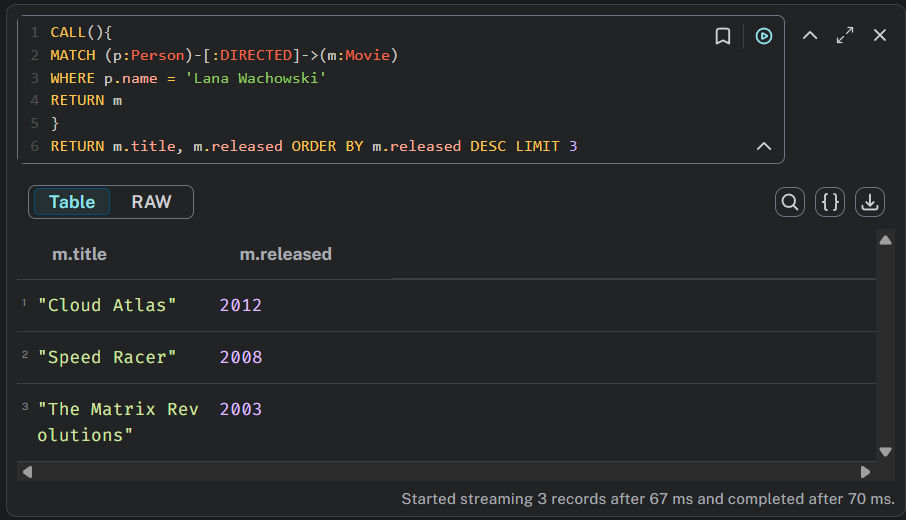

### 10. Ejercicios finales

#### Q1. Encuentra actores que hayan trabajado tanto con Tom Hanks como con Kevin Bacon en al menos una película. No tiene porque haber coincidido en esa película con los dos.

> MATCH (p1:Person)-[:ACTED_IN]->(:Movie)<-[:ACTED_IN]-(p2:Person)  
> WHERE p2.name = 'Tom Hanks'  
> WITH p1  
> MATCH (p1)-[:ACTED_IN]->(:Movie)<-[:ACTED_IN]-(p3:Person)  
> WHERE p3.name = 'Kevin Bacon'  
> RETURN DISTINCT p1.name  

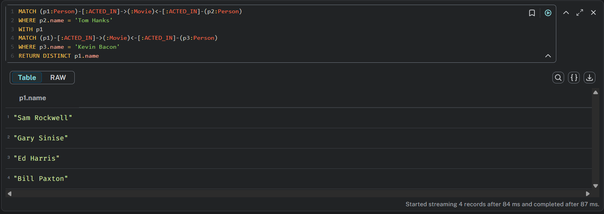

#### Q2. Encuentra actores que hayan trabajado con Tom Hanks y con Kevin Bacon en la misma película.

> MATCH (p1:Person)-[:ACTED_IN]->(m:Movie)<-[:ACTED_IN]-(p2:Person)  
> WHERE p2.name = 'Tom Hanks'  
> WITH p1, m.title as pelicula  
> MATCH (p1)-[:ACTED_IN]->(m)<-[:ACTED_IN]-(p3:Person)  
> WHERE p3.name = 'Kevin Bacon' and m.title = pelicula  
> RETURN DISTINCT p1.name, m.title  

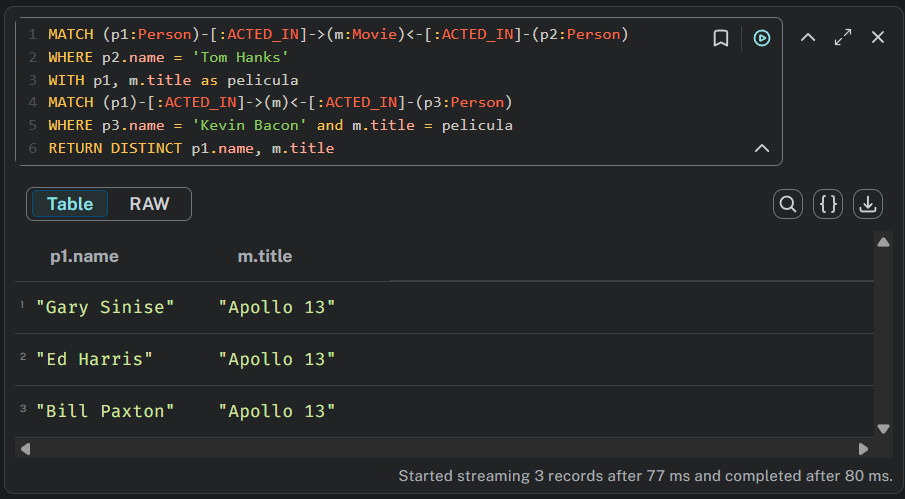

#### Q3. Encuentra los directores que hayan trabajado en más de 2 películas con un mismo actor

> MATCH (d:Person)-[:DIRECTED]->(m:Movie)<-[:ACTED_IN]-(a:Person)  
> WITH d, a, COUNT(DISTINCT m) AS peliculasJuntos  
> WHERE peliculasJuntos > 2  
> RETURN d.name AS director, a.name AS actor, peliculasJuntos  
> ORDER BY peliculasJuntos DESC;  

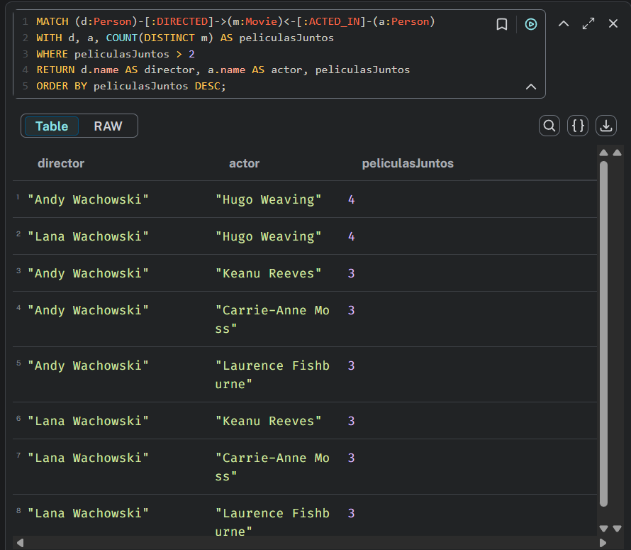

#### Q4. Películas dirigidas y escritas por la misma persona

> MATCH (p:Person)-[:DIRECTED]->(m:Movie)<-[:WROTE]-(p)  
> RETURN p.name, m.title  

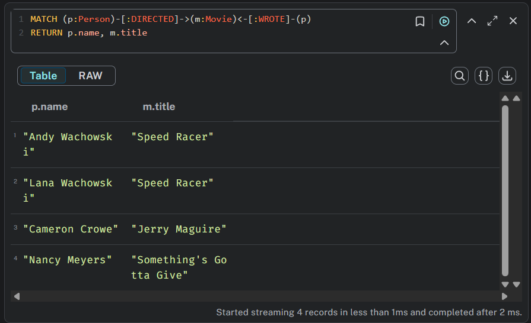

#### Q5. Actores que hayan actuado en películas con calificaciones promedio mayores a 70

> MATCH (p:Person)-[r:REVIEWED]->(m:Movie)  
> WHERE r.rating>=70  
> WITH m  
> MATCH (p:Person)-[:ACTED_IN]->(m)  
> RETURN p.name,m.title  

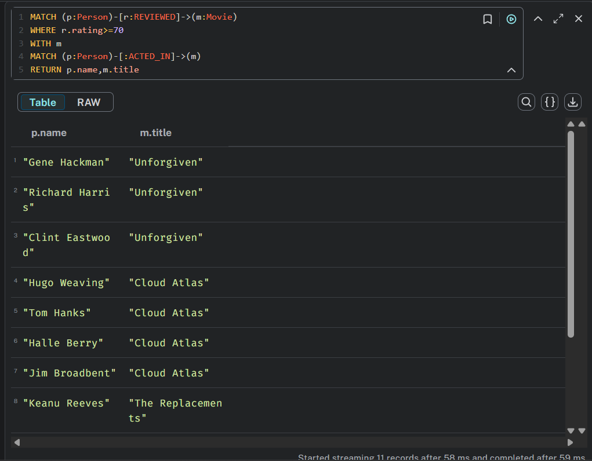

#### Q6. Encuentra las personas a las que sigue un usuario, hasta tres niveles

> MATCH m =((p:Person)-[r:FOLLOWS*3]-(others:Person))  
> RETURN m  

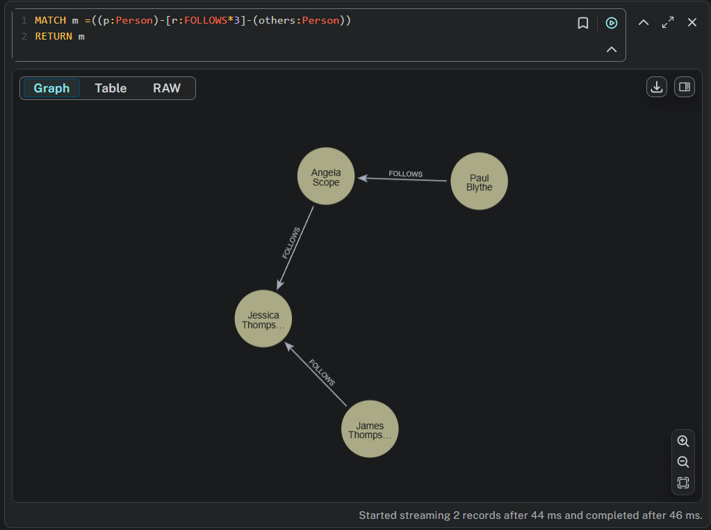

#### Q7. Películas donde los actores han desempeñado múltiples roles

> MATCH (p:Person)-[r:ACTED_IN]->()  
> WITH p.name AS actor, apoc.coll.flatten(collect(r.roles)) AS roles  
> WHERE size(roles) > 3  
> RETURN actor, roles  

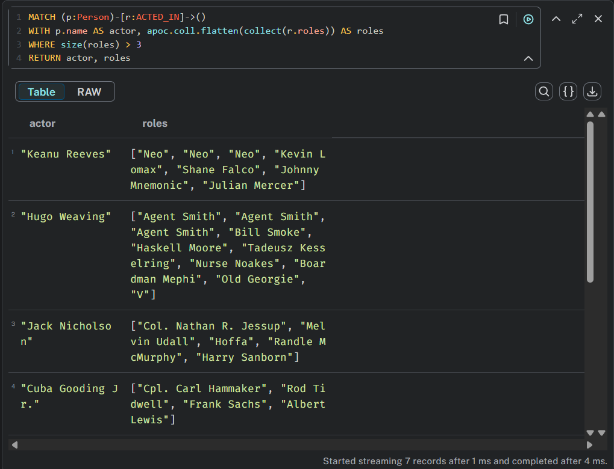

#### Q8. Películas con la mayor cantidad de reseñas

> MATCH (:Person)-[:REVIEWED]->(n:Movie)  
> RETURN n.title AS movie, count(*) AS numReviews  
> ORDER BY numReviews DESC  

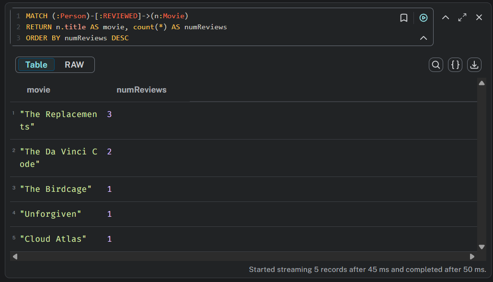

#### Q9. Encuentra los actores que han actuado juntos en más de una película

> MATCH (a:Person)-[:ACTED_IN]->(m:Movie)<-[:ACTED_IN]-(b:Person)  
> WHERE a <> b  
> WITH a, b, collect(m.title) AS movies, count(m) AS numMovies  
> WHERE numMovies > 1  
> RETURN a.name AS actor1, b.name AS actor2, numMovies, movies  
> ORDER BY numMovies DESC  

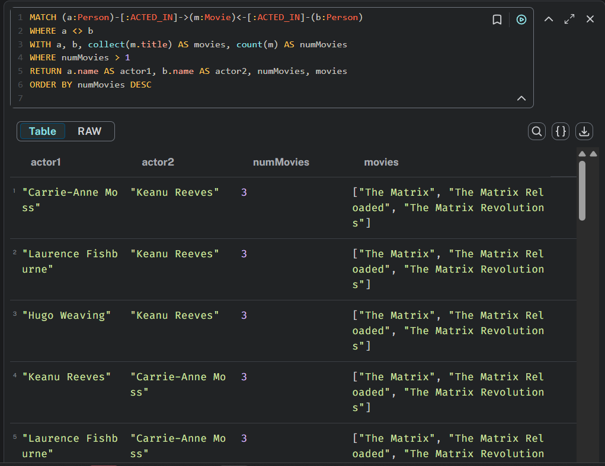

#### Q10. Encuentra todas las películas producidas, escritas y dirigidas por una misma persona

> MATCH (p:Person)-[:PRODUCED]->(m:Movie),  
>       (p)-[:WROTE]->(m),  
>       (p)-[:DIRECTED]->(m)  
> RETURN p.name AS person, m.title AS movie  
> ORDER BY person, movie  

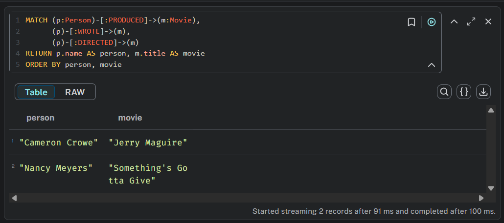

#### Q11. Encuentra el actor que más ha trabajado con el director Lana Wachowski

> MATCH (p:Person)-[:DIRECTED]->(m:Movie)<-[:ACTED_IN]-(a:Person)  
> WHERE p.name = "Lana Wachowski"  
> WITH a, count(m) AS numMovies, collect(m.title) AS movies  
> ORDER BY numMovies DESC  
> RETURN a.name AS a, numMovies, movies  

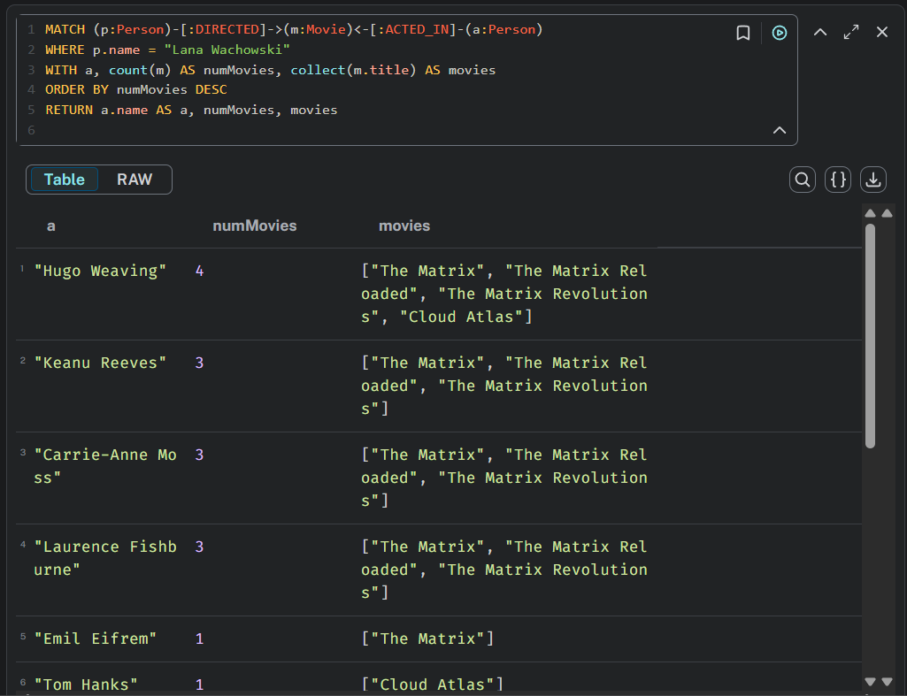

### 11. Conclusión

En esta práctica hemos aprendido a realizar consultas en Neo4J utilizando el lenguaje Cypher. Hemos visto cómo utilizar diferentes cláusulas y funciones para obtener la información deseada de la base de datos de películas. Además, hemos practicado con ejercicios que nos han permitido profundizar en el uso de Cypher y en la comprensión de la estructura de los grafos en Neo4J.
